## Audit Procedures: Gap Detection with Power Query
<br>

In this series, we're going to explore the use of Power Query in Auditing. In this tutorial, we're going to do Gap Detection. 

Gap Detection is a technique wherein missing number are determined within a longer list of number. For example, determining the missing invoices within a longer list of invoice numbers.

Gap Detection is a helpful in order to test where controls are adequate and plan the appropriate substantive test to get reasonable assurance that financial statements are fairly stated.

Normally, we do this kind of test using specialized audit softwares which may cost hundred of dollars. Now, with the use of Power Query, we can now build these tools using Excel and save tons of money.

### The Process
Determining gaps within a list of invoices basically involve comparing two sets of data, the client-given invoices and the population of all invoices. This can be visualized with the help of the following

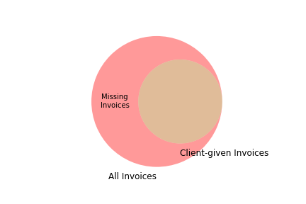

Client-given invoices (green circle) is a subset of the population of all the invoices (red circle). Anything that's outside the green circle but within the red circle can be thought of as the missing invoices or the "gap".

In database parlance, this "gap" is the result of the left-outer join between the population of all invoices and and the client invoices.

Let's now proceed doing this in Power Query.

### Preparing the Population
To follow along, you could download the exercise files from here(TODO).

1. Create a new workbook and named it Gap Detection.xlsx. Create a new query from Workbook and choose Invoice List.xlsx. The file Invoice List.xlsx contains the client-given invoices.

2. In the query, promote the first row as headers and change the column types as necessary. 

	The data should now look like this
	
	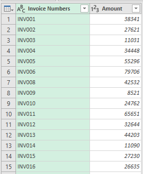

3. Duplicate this query. From this query, we're going to get the first and last invoice numbers and recreate the complete list of invoices. This then will be the population of all invoices.
	
4. The invoice number is formatted as "INV" followed by the three-digit invoice numbers. To get the first and last invoice numbers, we have to get the numeric part of the Invoice Numbers. Select the Invoice Numbers column and go to Add Column tab > Extract > Last Characters and put "3".

	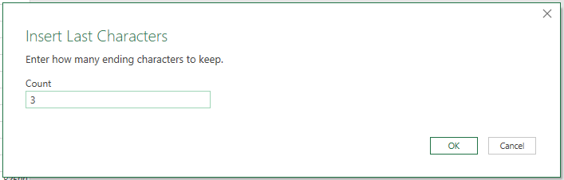

	Convert the resulting column to numbers. The data should now look like this

	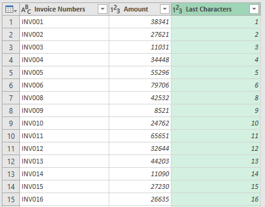


5. From this new column, we're going to extract the minimum and maximum numbers. Go to Home tab > Advanced Editor and add the following code
	
	```
	Min = List.Min(#"Changed Type1"[Last Characters]),
    Max = List.Max(#"Changed Type1"[Last Characters]),
    Custom3 = {Min..Max},
	```

	The data should now look like this

	
	
	
	There's now a new Transform tab that appears at the top. This is a contextual tab as the resulting data from the step above is a list. 

	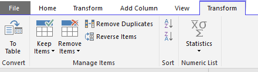


	Go to this tab and click on the To Table. Accept the defaults in the dialog box

	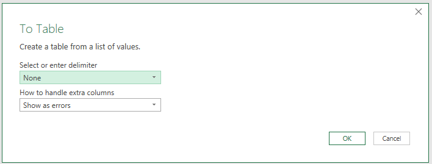
	

6. Now we have to create a new column to combine "INV" with these numbers. But before that, we have to convert our to column to text. Concatenation only works for text data. 
	
	Prepend the numbers too with zeroes. The challenge here is that the number of zeroes to add depend on the length of the numeric string. For example, if the number is "1", prepend with "00". If the number is "27", prepend with "0". 

	The easiest way to do this is to add 2 zeroes and extract the last 3 characters from the resulting string. 

	Go to Transform > Format > Add Prefix and add 2 zeroes

	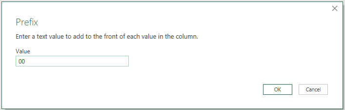

	Now go to Transform > Extract > Last Characters and put 3
	
	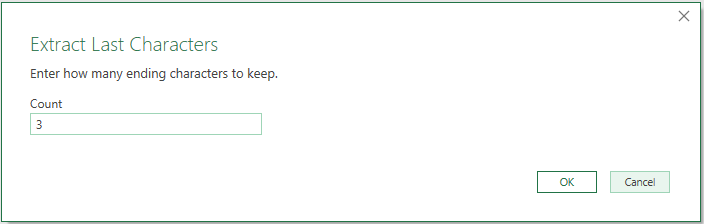

	The data should like this after convertion

	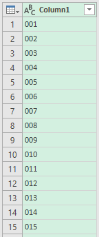


7. Create a new column to combine the "INV" to this column. Go to Add Column > Custom Column

	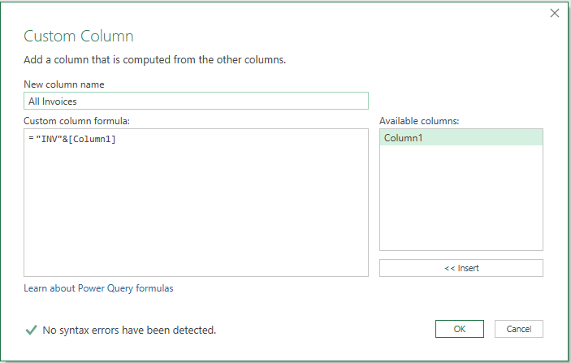

	Remove the original column. This now our list of all the invoices (population)

	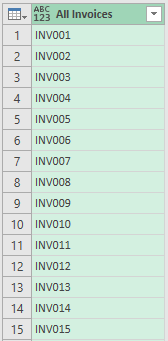

### Extracting the Missing Invoice Numbers
Now to extract the missing invoice numbers, we're going to do a left anti join of the population and the client-invoices.

Create a new merge query. Choose the population query first and the client-invoices query second. Choose Left-Anti join
	
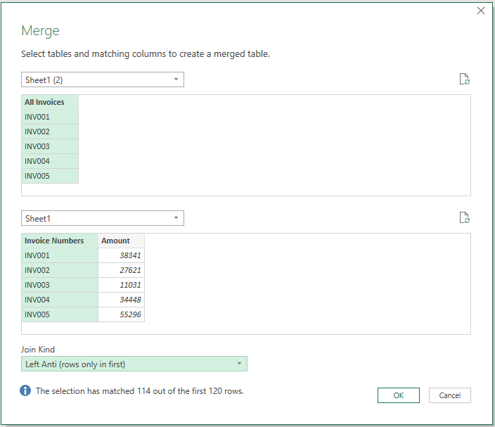

These are now your missing invoice numbers. If you expand the table column, this should contain nulls. The reason is that the resulting invoices numbers from the merge are the ones missing from the client-invoices hence they are all nulls. You could try this on your own!

Remove unnecessary columns. The final data should like this

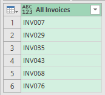

### Conclusion
In this tutorial, you have learned how to use Power Query to detect missing invoice numbers. 

You could reuse this workbook for future instances involving gap detection. Point the workbook to a new file, refresh the query, and you're good to go. 

Power Query is definitely a must to an auditor's toolbox.

That's it for now. In the next post, we're going to discuss how to use Power Query in order to detect duplicate invoice numbers.

**Stay Querious. Happy coding!**


	


	


