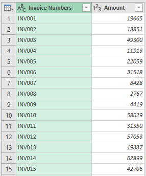
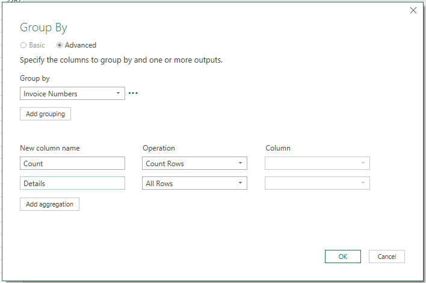
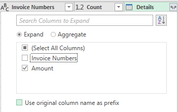
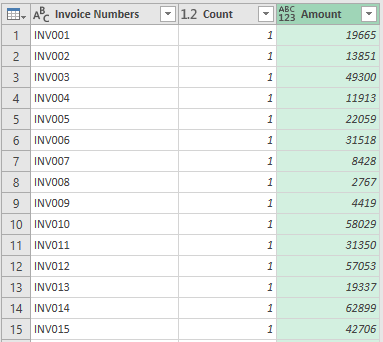
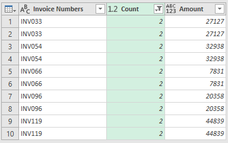

## Audit Procedures: Duplicate Detection with Power Query

This is the Part 2 of the series on the Audit Procedures in Power Query series
If you missed the **Part 1**, you can read it **[here](../audit-procedures-in-power-query-gap-detection/)**

Duplicate Detection is a technique wherein duplicates are detected from a list of numbers. For example, determining the duplicate invoice numbers within a longer list of invoice numbers.

The possible effects of having duplicates in the books is problematic for a lot of reasons. For example, if there are duplicates in the Invoice Numbers, this results to higher sales, higher taxes and therefore higher cash requirements.

Duplicate Detection is a helpful in order to test where controls are adequate and plan the appropriate substantive test to get reasonable assurance that financial statements are fairly stated.

Normally, we do this kind of test using specialized audit softwares which may cost hundred of dollars. Now, with the use of Power Query, we can now build these tools using Excel and save tons of money.

### The Process
To follow along, you could download the exercise files from here(TODO).

1. Create a new workbook and named it Duplicate Detection.xlsx. Create a new query from Workbook and choose Invoice List.xlsx
2. In the query, promote the first row as headers and change the column types as necessary. 

	The data should now look like this

	

3. Next, select the Invoice Numbers column and go to Transform > Group By

	
	
	The data should now look like this. Expand the Details table column but include only the amount.

	

	The data should now look like this

	

4. Determining the duplicates now consists of filtering the rows where Count > 1. Doing that gives us the following
	
	

	Why did I chose to output the original and it's duplicate? The reason is that we may have a duplicate that has a different amount. As part of the audit, we have to investigate why the amount is also different.

### 
### Conclusion